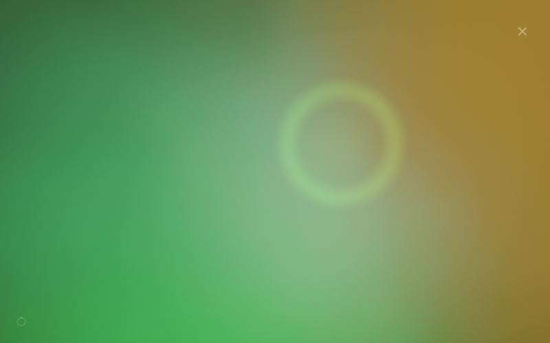
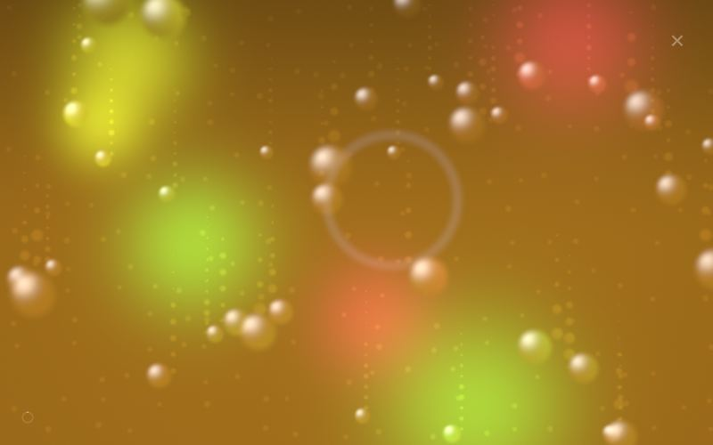
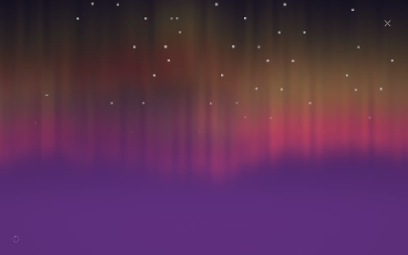
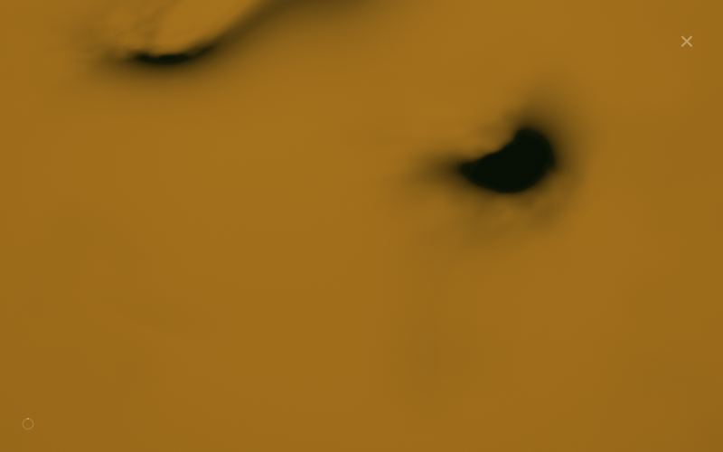
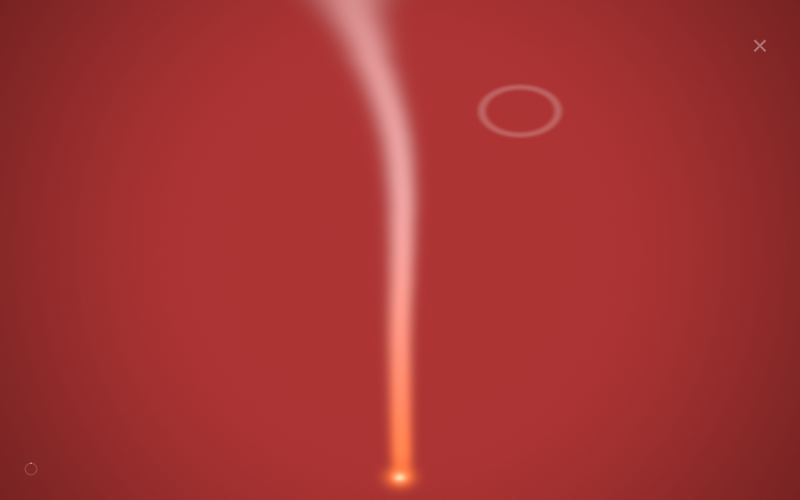
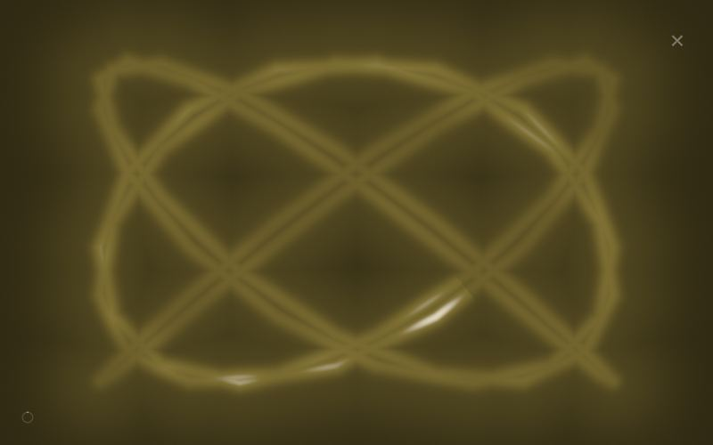
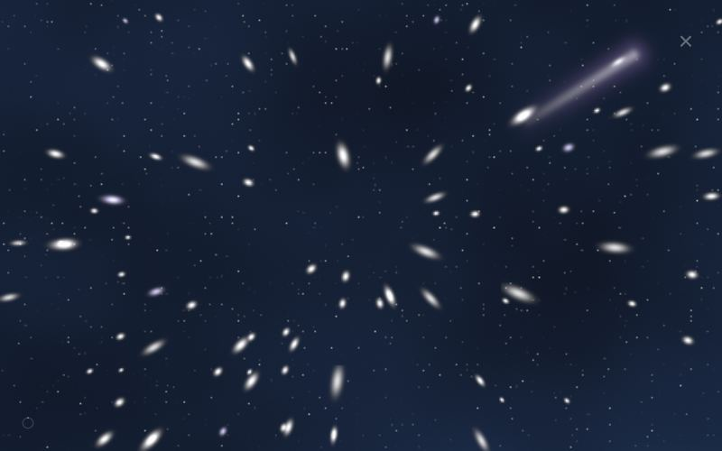
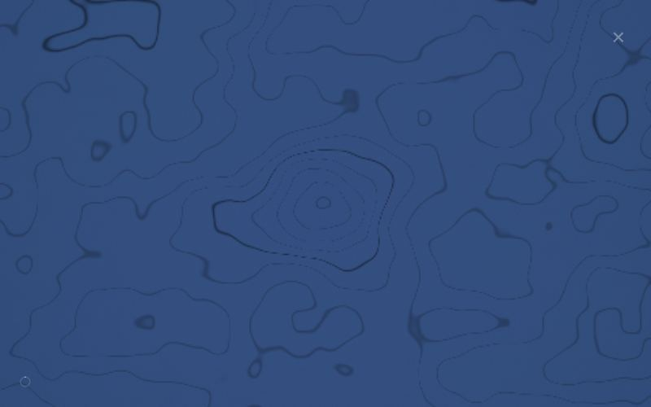
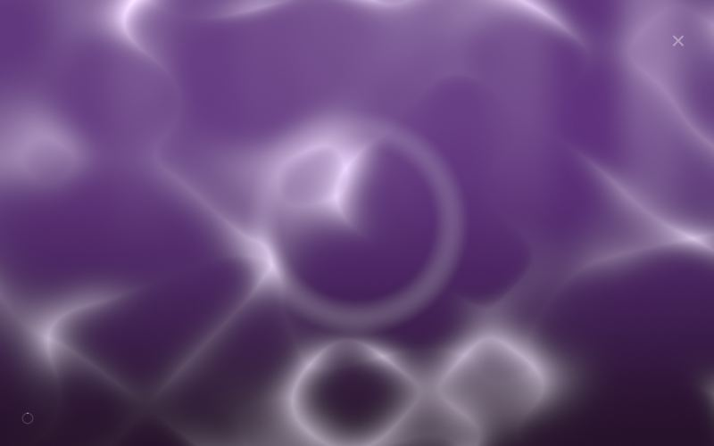
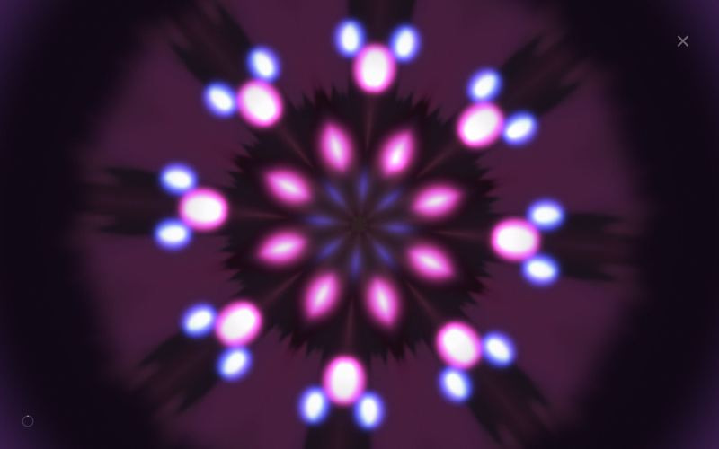

# Visualizations

The player's eleven visualizations (⊙ button during playback; picker in the lower-right of the overlay). Each derives its palette from the live background color, answers taps in its own vocabulary, and reacts to device tilt. See the "Visualizer model" section of [CLAUDE.md](../../CLAUDE.md) for the maintained technical model.

**Bloom** — The default. iOS-wallpaper-style soft color field derived from the playlist color, drifting organically with no hard edges; taps bloom expanding rings; tilt pours the colors like thick gel.

**Rain** — Beaded drops running down glass, refracting bokeh lights behind it, with trails and micro-droplets. Tilt leans the streaks toward gravity and speeds the rain; taps splat as refractive rings.

**Aurora** — Rippling light curtains with ray striations over a dusk sky whose horizon glow is the live background, under twinkling stars. Tilt is wind and lift; taps send a shimmer rising through the curtains.

**Ink** — Dark plumes dropped into live-bg water: they rise, curl into tendrils, widen, and dilute over 25 seconds, absorbing light where they pass. Tap drops ink at your finger; tilt leans the climb.

**Incense** — A single luminous smoke line rising from a throbbing ember — laminar at the base, swaying and dispersing at the top. Tilt is a draft bending the upper ribbon; taps release rising smoke rings.

**Scope** — A phosphor beam — always the live background color — tracing Lissajous figures that morph every 30 seconds and advance with each track. Tilt skews the figure in pseudo-3D; taps race a brightness pulse along the trace.

**Stars** — Four parallax shells of stars streaming out of a vanishing point over a nebula tinted by the live background. Tilting steers the camera; taps launch comets along their outward ray.

**Topo** — Hand-drawn contour lines of a slowly remolding landscape on live-bg paper with fiber grain. Tilt parallaxes by elevation (2.5D pop); a tap raises a 12-second peak whose contour rings bloom outward and erode away.

**Caustics** — A refracted-light web playing over sunlit live-bg water, god rays slanting into the deep. Tilt moves the sun; taps drop ripple rings that warp the web outward.

**Kaleido** — The feedback visualization: every frame folds the last into a precessing k-fold mirrored wedge, seeded by scheduled sparks that trail into mandalas. Taps fast-clear and re-bloom at your finger; each track change steps the symmetry order (6→8→10→12).
